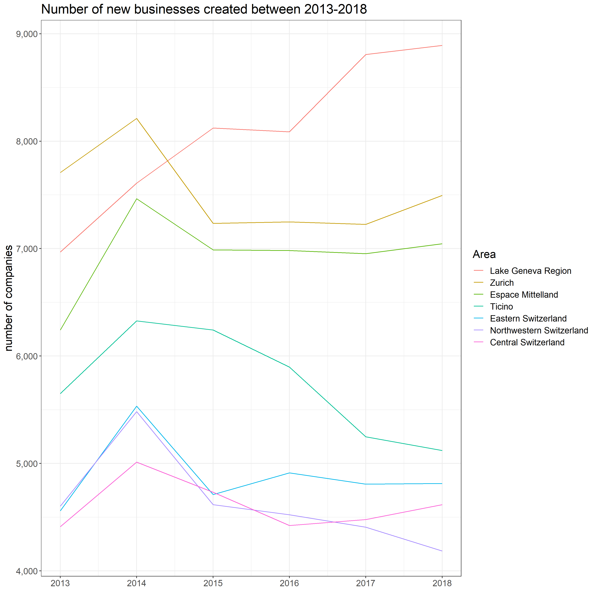
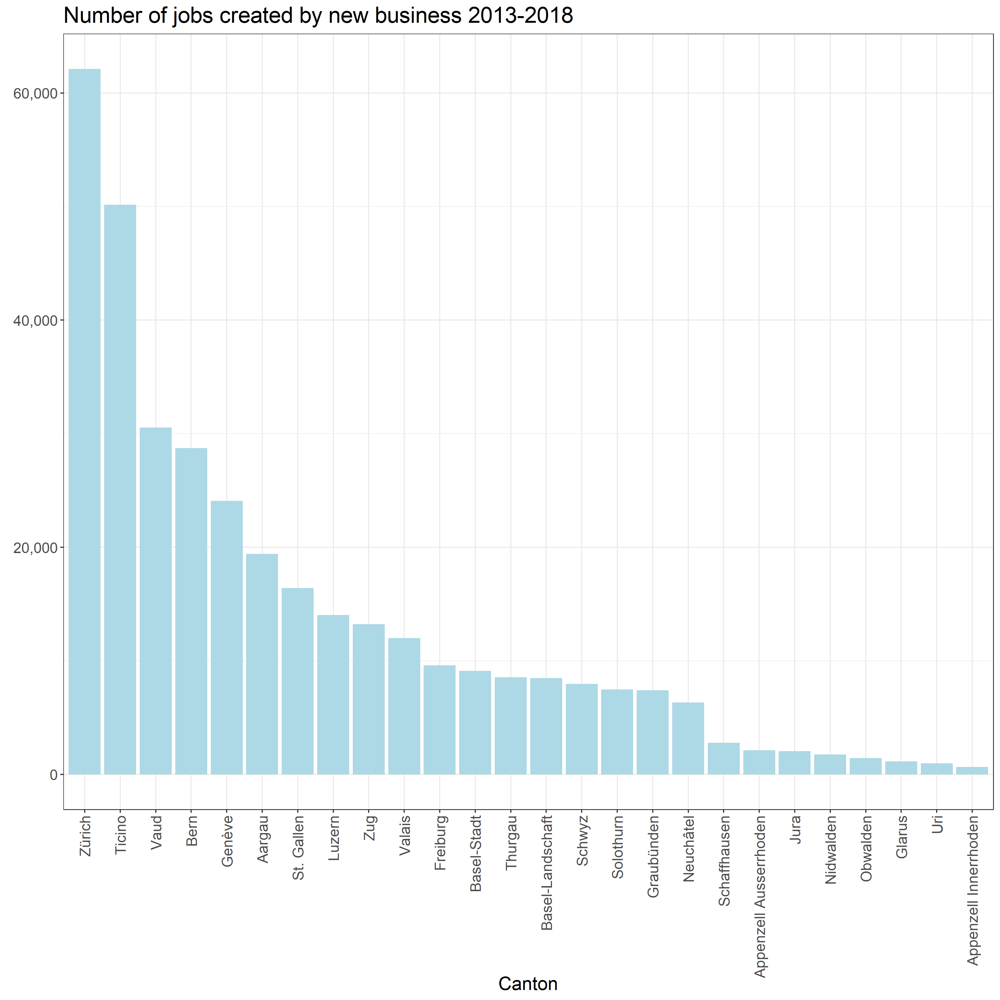



  <button type="button" class="btn btn-primary" data-toggle="collapse" data-target="#instructions">what to do here?</button>
  

     
    <b>Scroll / Click</b> left or right to get more questions. Don't worry; there are no scores, and no data is recorded, so have fun!
     
  

  <!-- start of questions -->
  

   <!--question #1 -->
    

      
      

        <h3>the question is...</h3>
         <h5>Which region had the highest number of new businesses created in year 2018?</h5> 
        

          

            

              <a class="card-link" data-toggle="collapse" href="#collapseOne1">
                Espace Mittelland
              </a>
            

            

              

                This is <b>no</b> correct.  But please, give another try!
              

            

          

          

            

              <a class="collapsed card-link" data-toggle="collapse" href="#collapseTwo1">
              Eastern Switzerland
            </a>
            

            

              

              This is <b>no</b> correct.  But please, give another try!
              

            

          

          

            

              <a class="collapsed card-link" data-toggle="collapse" href="#collapseThree1">
                Lake Geneva Region
              </a>
            

            

              

              This is <b>Correct!</b> 
               Here a plot with more details about it  
              
               
              You can explore more at <a href="https://recipes.swiss/en/dataset/neu-gegrundete-unternehmen-nach-kantonen4/">https://recipes.swiss/en/dataset/</a>
               
              

            

          

        

      

    

    <!--question #2 -->
    

      
      

        <h3>the question is...</h3>
         <h5>Which three cantons had the highest number of jobs created by new business in the period 2013-2018?</h5> 
        

          

            

              <a class="card-link" data-toggle="collapse" href="#collapseOne2">
                Zürich, Ticino, Vaud
              </a>
            

            

              

              This is <b>Correct!</b> 
               Here a plot with more details about it  
              
               
              You can explore more at <a href="https://recipes.swiss/en/dataset/neu-gegrundete-unternehmen-nach-kantonen4/">https://recipes.swiss/en/dataset/</a>
               
              

            

          

          

            

              <a class="collapsed card-link" data-toggle="collapse" href="#collapseTwo2">
              Ticino, Schaffhausen, Vaud
            </a>
            

            

              

                This is <b>no</b> correct.  But please, give another try!
              

            

          

          

            

              <a class="collapsed card-link" data-toggle="collapse" href="#collapseThree2">
                Thurgau, Appenzell Ausserrhoden, Uri
              </a>
            

            

              

              This is <b>no</b> correct.  But please, give another try!
              

            

          

        

      

    

    <!--question #3 -->
    

      
      

        <h3>the question is...</h3>
         <h5>Which region had the highest number of new businesses created in year 2013?</h5> 
        

          

            

              <a class="card-link" data-toggle="collapse" href="#collapseOne3">
                Zurich
              </a>
            

            

              

              This is <b>Correct!</b> 
               Here a plot with more details about it  
              
               
              You can explore more at <a href="https://recipes.swiss/en/dataset/neu-gegrundete-unternehmen-nach-kantonen4/">https://recipes.swiss/en/dataset/</a>
               
              

            

          

          

            

              <a class="collapsed card-link" data-toggle="collapse" href="#collapseTwo3">
              Lake Geneva Region
            </a>
            

            

              

              This is <b>no</b> correct.  But please, give another try!
              

            

          

          

            

              <a class="collapsed card-link" data-toggle="collapse" href="#collapseThree3">
                Ticino
              </a>
            

            

              

              This is <b>no</b> correct.  But please, give another try!
              

            

          

        

      

    

    <!--question #4 -->
    

      
      

        <h3>the question is...</h3>
         <h5>Which three cantons had the highest number of jobs created by new business in the period 2013-2018?</h5> 
        

          

            

              <a class="card-link" data-toggle="collapse" href="#collapseOne4">
                Zürich, Ticino, Vaud
              </a>
            

            

              

              This is <b>Correct!</b> 
               Here a plot with more details about it  
              
               
              You can explore more at <a href="https://recipes.swiss/en/dataset/neu-gegrundete-unternehmen-nach-kantonen4/">https://recipes.swiss/en/dataset/</a>
               
              

            

          

          

            

              <a class="collapsed card-link" data-toggle="collapse" href="#collapseTwo4">
              Basel-Landschaft, Aargau, Bern
            </a>
            

            

              

              This is <b>no</b> correct.  But please, give another try!
              

            

          

          

            

              <a class="collapsed card-link" data-toggle="collapse" href="#collapseThree4">
                Schwyz, Basel-Stadt, Ticino
              </a>
            

            

              

              This is <b>no</b> correct.  But please, give another try!
              

            

          

        

      

    

    <!--question #5 -->
    

      
      

        <h3>the question is...</h3>
         <h5>Which three cantons had the highest number of jobs created by new business in the period 2013-2018?</h5> 
        

          

            

              <a class="card-link" data-toggle="collapse" href="#collapseOne5">
                Schaffhausen, Neuchâtel, St. Gallen
              </a>
            

            

              

              This is <b>no</b> correct.  But please, give another try!
              

            

          

          

            

              <a class="collapsed card-link" data-toggle="collapse" href="#collapseTwo5">
              Obwalden, Genève, Solothurn
            </a>
            

            

              

              This is <b>no</b> correct.  But please, give another try!
              

            

          

          

            

              <a class="collapsed card-link" data-toggle="collapse" href="#collapseThree5">
                Zürich, Ticino, Vaud
              </a>
            

            

              

              This is <b>Correct!</b> 
               Here a plot with more details about it  
              
               
              You can explore more at <a href="https://recipes.swiss/en/dataset/neu-gegrundete-unternehmen-nach-kantonen4/">https://recipes.swiss/en/dataset/</a>
               
              

            

          

        

      

    

    <!--question #6 -->
    

      
      

        <h3>the question is...</h3>
         <h5>Which three cantons had the highest number of jobs created by new business in the period 2013-2018?</h5> 
        

          

            

              <a class="card-link" data-toggle="collapse" href="#collapseOne6">
                Genève, Glarus, Luzern
              </a>
            

            

              

              This is <b>no</b> correct.  But please, give another try!
              

            

          

          

            

              <a class="collapsed card-link" data-toggle="collapse" href="#collapseTwo6">
              Basel-Stadt, Appenzell Ausserrhoden, Aargau
            </a>
            

            

              

              This is <b>no</b> correct.  But please, give another try!
              

            

          

          

            

              <a class="collapsed card-link" data-toggle="collapse" href="#collapseThree6">
                Zürich, Ticino, Vaud
              </a>
            

            

              

              This is <b>Correct!</b> 
               Here a plot with more details about it  
              
               
              You can explore more at <a href="https://recipes.swiss/en/dataset/neu-gegrundete-unternehmen-nach-kantonen4/">https://recipes.swiss/en/dataset/</a>
               
              

            

          

        

      

    

  <!-- end of questions -->
  

  <a class="carousel-control-prev" href="#carouselExampleControls" role="button" data-slide="prev">
    
    Previous
  </a>
  <a class="carousel-control-next" href="#carouselExampleControls" role="button" data-slide="next">
    
    Next
  </a>



---



   
    <h3><a href="../../">back to Home</a></h3>
   



---
