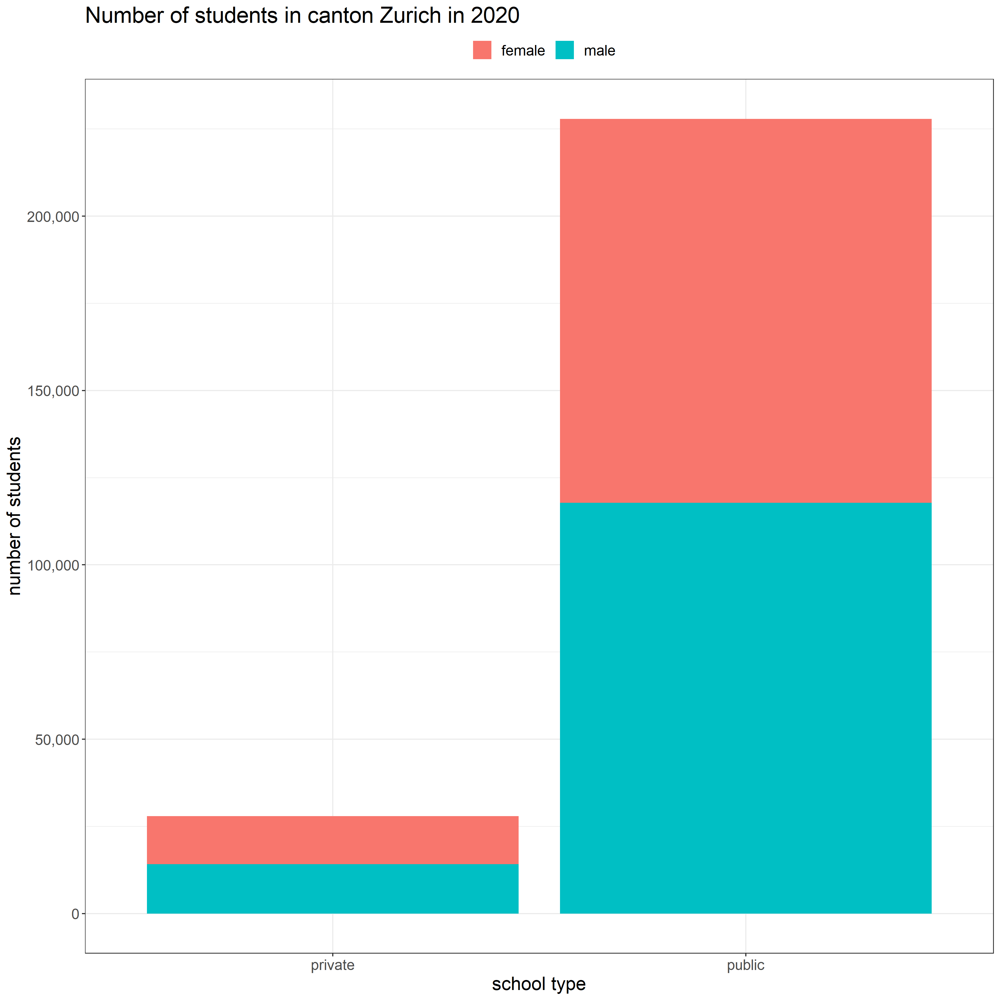
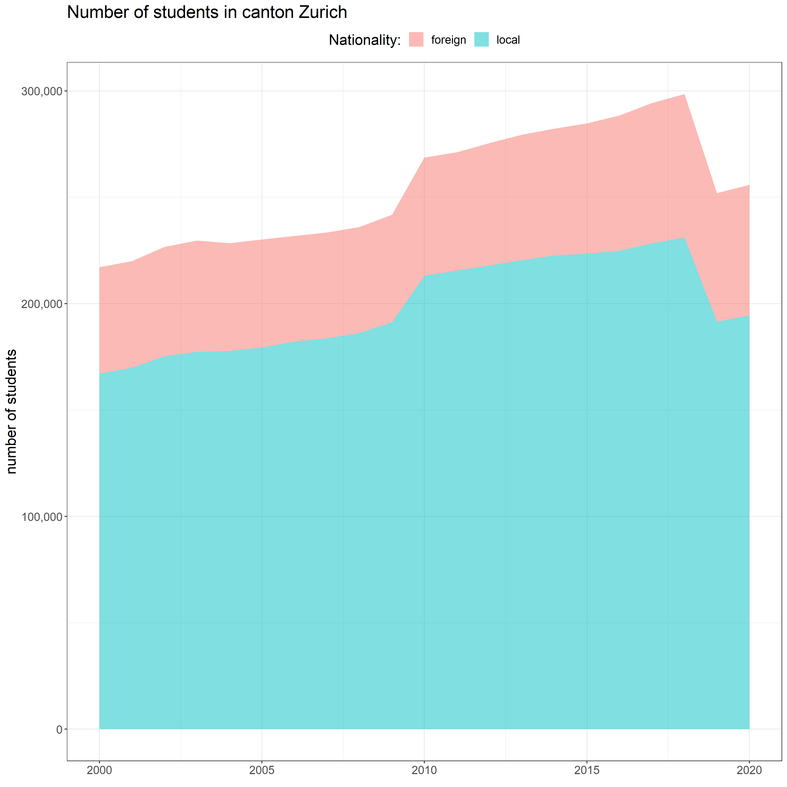



  <button type="button" class="btn btn-primary" data-toggle="collapse" data-target="#instructions">what to do here?</button>
  

     
    <b>Scroll / Click</b> left or right to get more questions. Don't worry; there are no scores, and no data is recorded, so have fun!
     
  

  <!-- start of questions -->
  

   <!--question #1 -->
    

      
      

        <h3>the question is...</h3>
         <h5>What was the share of female students in public schools in canton Zurich in 2020?</h5> 
        

          

            

              <a class="card-link" data-toggle="collapse" href="#collapseOne1">
                51.7%
              </a>
            

            

              

                This is <b>no</b> correct.  But please, give another try!
              

            

          

          

            

              <a class="collapsed card-link" data-toggle="collapse" href="#collapseTwo1">
              48.3%
            </a>
            

            

              

                This is <b>Correct!</b> 
                 Here a plot with more details about this election  
                
                 
                You can explore more at <a href="https://opendata.swiss/en/dataset/ubersicht-uber-alle-lernenden-im-kanton-zurich">https://opendata.swiss/.../kanton-zurich</a>
                 
              

            

          

          

            

              <a class="collapsed card-link" data-toggle="collapse" href="#collapseThree1">
                49.3%
              </a>
            

            

              

                This is <b>no</b> correct.  But please, give another try!
              

            

          

        

      

    

    <!--question #2 -->
    

      
      

        <h3>the question is...</h3>
         <h5>What was the share of foreign students in year 2020 in canton Zurich?</h5> 
        

          

            

              <a class="card-link" data-toggle="collapse" href="#collapseOne2">
                24%
              </a>
            

            

              

              This is <b>Correct!</b> 
               Here a plot with more details about this election  
              
               
              You can explore more at <a href="https://opendata.swiss/en/dataset/ubersicht-uber-alle-lernenden-im-kanton-zurich">https://opendata.swiss/.../kanton-zurich</a>
               
              

            

          

          

            

              <a class="collapsed card-link" data-toggle="collapse" href="#collapseTwo2">
              79.3%
            </a>
            

            

              

                This is <b>no</b> correct.  But please, give another try!
              

            

          

          

            

              <a class="collapsed card-link" data-toggle="collapse" href="#collapseThree2">
                77%
              </a>
            

            

              

              This is <b>no</b> correct.  But please, give another try!
              

            

          

        

      

    

    <!--question #3 -->
    

      
      

        <h3>the question is...</h3>
         <h5>What was the share of local students in year 2000 in canton Zurich?</h5> 
        

          

            

              <a class="card-link" data-toggle="collapse" href="#collapseOne3">
                76%
              </a>
            

            

              

              This is <b>no</b> correct.  But please, give another try!
              

            

          

          

            

              <a class="collapsed card-link" data-toggle="collapse" href="#collapseTwo3">
              79.3%
            </a>
            

            

              

              This is <b>no</b> correct.  But please, give another try!
              

            

          

          

            

              <a class="collapsed card-link" data-toggle="collapse" href="#collapseThree3">
                77%
              </a>
            

            

              

              This is <b>Correct!</b> 
               Here a plot with more details about this election  
              
               
              You can explore more at <a href="https://opendata.swiss/en/dataset/ubersicht-uber-alle-lernenden-im-kanton-zurich">https://opendata.swiss/.../kanton-zurich</a>
               
              

            

          

        

      

    

    <!--question #4 -->
    

      
      

        <h3>the question is...</h3>
         <h5>What was the share of male students in private schools in canton Zurich in 2020?</h5> 
        

          

            

              <a class="card-link" data-toggle="collapse" href="#collapseOne4">
                48.3%
              </a>
            

            

              

              This is <b>no</b> correct.  But please, give another try!
              

            

          

          

            

              <a class="collapsed card-link" data-toggle="collapse" href="#collapseTwo4">
              49.3%
            </a>
            

            

              

              This is <b>no</b> correct.  But please, give another try!
              

            

          

          

            

              <a class="collapsed card-link" data-toggle="collapse" href="#collapseThree4">
                50.7%
              </a>
            

            

              

              This is <b>Correct!</b> 
               Here a plot with more details about this election  
              
               
              You can explore more at <a href="https://opendata.swiss/en/dataset/ubersicht-uber-alle-lernenden-im-kanton-zurich">https://opendata.swiss/.../kanton-zurich</a>
               
              

            

          

        

      

    

    <!--question #5 -->
    

      
      

        <h3>the question is...</h3>
         <h5>What was the share of foreign students in year 2010 in canton Zurich?</h5> 
        

          

            

              <a class="card-link" data-toggle="collapse" href="#collapseOne5">
                23%
              </a>
            

            

              

              This is <b>no</b> correct.  But please, give another try!
              

            

          

          

            

              <a class="collapsed card-link" data-toggle="collapse" href="#collapseTwo5">
              24%
            </a>
            

            

              

              This is <b>no</b> correct.  But please, give another try!
              

            

          

          

            

              <a class="collapsed card-link" data-toggle="collapse" href="#collapseThree5">
                20.7%
              </a>
            

            

              

              This is <b>Correct!</b> 
               Here a plot with more details about this election  
              
               
              You can explore more at <a href="https://opendata.swiss/en/dataset/ubersicht-uber-alle-lernenden-im-kanton-zurich">https://opendata.swiss/.../kanton-zurich</a>
               
              

            

          

        

      

    

    <!--question #6 -->
    

      
      

        <h3>the question is...</h3>
         <h5>What was the share of local students in year 2010 in canton Zurich?</h5> 
        

          

            

              <a class="card-link" data-toggle="collapse" href="#collapseOne6">
                79.3%
              </a>
            

            

              

              This is <b>Correct!</b> 
               Here a plot with more details about this election  
              
               
              You can explore more at <a href="https://opendata.swiss/en/dataset/ubersicht-uber-alle-lernenden-im-kanton-zurich">https://opendata.swiss/.../kanton-zurich</a>
               
              

            

          

          

            

              <a class="collapsed card-link" data-toggle="collapse" href="#collapseTwo6">
              76%
            </a>
            

            

              

              This is <b>no</b> correct.  But please, give another try!
              

            

          

          

            

              <a class="collapsed card-link" data-toggle="collapse" href="#collapseThree6">
                24%
              </a>
            

            

              

              This is <b>no</b> correct.  But please, give another try!
              

            

          

        

      

    

  <!-- end of questions -->
  

  <a class="carousel-control-prev" href="#carouselExampleControls" role="button" data-slide="prev">
    
    Previous
  </a>
  <a class="carousel-control-next" href="#carouselExampleControls" role="button" data-slide="next">
    
    Next
  </a>



---



   
    <h3><a href="../../">back to Home</a></h3>
   





  

   
  



---
