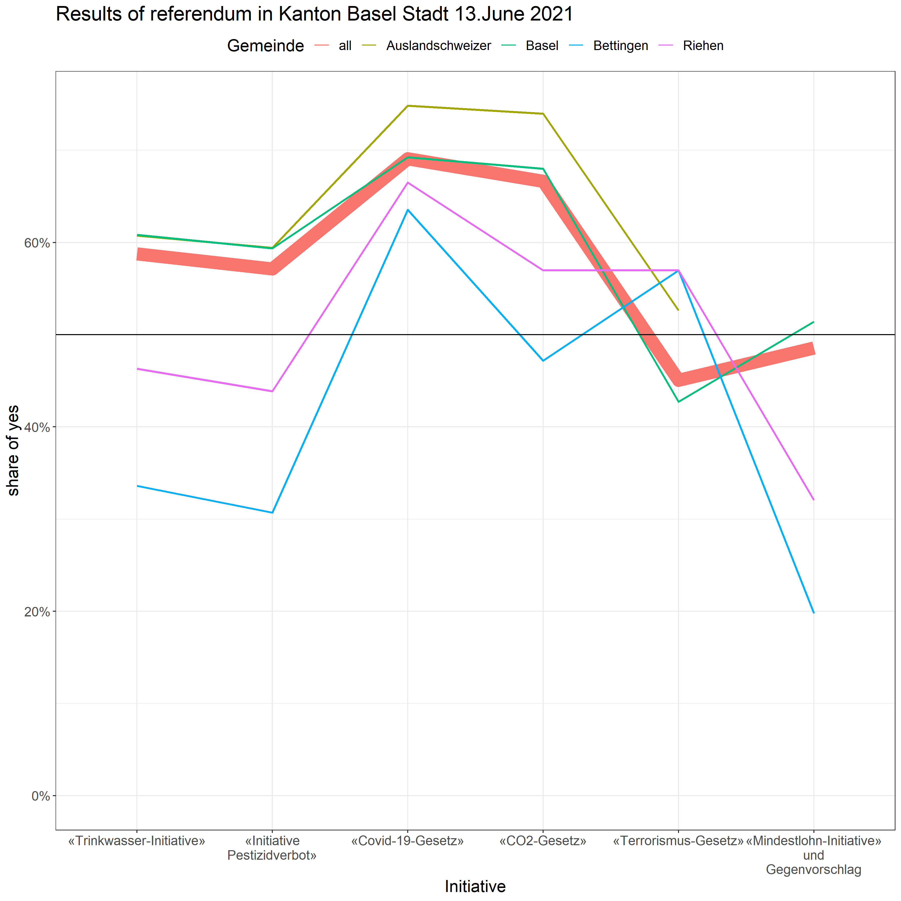
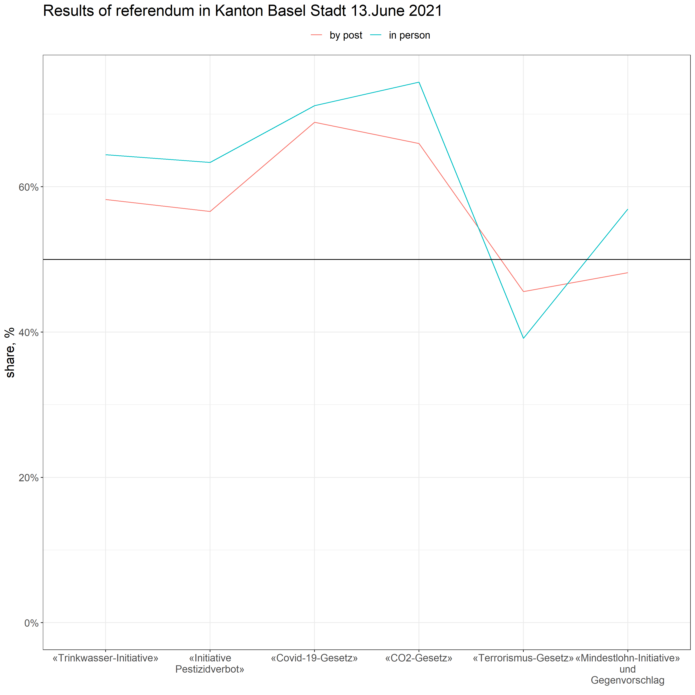



  <button type="button" class="btn btn-primary" data-toggle="collapse" data-target="#instructions">what to do here?</button>
  

     
    <b>Scroll / Click</b> left or right to get more questions. Don't worry; there are no scores, and no data is recorded, so have fun!
     
  

  <!-- start of questions -->
  

   <!--question #1 -->
    

      
      

        <h3>the question is...</h3>
         <h5>What is the share of 'No' votes in Kanton-Basel Stadt 13. June 2021 in Auslandschweizer for "Trinkwasser-Initiative"?</h5> 
        

          

            

              <a class="card-link" data-toggle="collapse" href="#collapseOne1">
                42.8%
              </a>
            

            

              

                This is <b>no</b> correct.  But please, give another try!
              

            

          

          

            

              <a class="collapsed card-link" data-toggle="collapse" href="#collapseTwo1">
              39.2%
            </a>
            

            

              

                This is <b>Correct!</b> 
                 Here a plot with more details about this election  
                
                 
                You can explore more at <a href="https://data.bs.ch/explore/dataset/100144/table/">https://data.bs.ch/explore/dataset/100144/table/</a>
                 
              

            

          

          

            

              <a class="collapsed card-link" data-toggle="collapse" href="#collapseThree1">
                51.4%
              </a>
            

            

              

                This is <b>no</b> correct.  But please, give another try!
              

            

          

        

      

    

    <!--question #2 -->
    

      
      

        <h3>the question is...</h3>
         <h5>What is the share of 'Yes' votes in Kanton-Basel Stadt 13. June 2021 in Riehen for "Mindestlohn-Initiative" und Gegenvorschlag?</h5> 
        

          

            

              <a class="card-link" data-toggle="collapse" href="#collapseOne2">
                60.8%
              </a>
            

            

              

                This is <b>no</b> correct.  But please, give another try!
              

            

          

          

            

              <a class="collapsed card-link" data-toggle="collapse" href="#collapseTwo2">
              51.4%
            </a>
            

            

              

                This is <b>no</b> correct.  But please, give another try!
              

            

          

          

            

              <a class="collapsed card-link" data-toggle="collapse" href="#collapseThree2">
                32%
              </a>
            

            

              

              This is <b>Correct!</b> 
               Here a plot with more details about this election  
              
               
              You can explore more at <a href="https://data.bs.ch/explore/dataset/100144/table/">https://data.bs.ch/explore/dataset/100144/table/</a>
               
              

            

          

        

      

    

    <!--question #3 -->
    

      
      

        <h3>the question is...</h3>
         <h5>What is the share of 'Yes' votes in Kanton-Basel Stadt 13. June 2021 made in person for "Terrorismus-Gesetz"?</h5> 
        

          

            

              <a class="card-link" data-toggle="collapse" href="#collapseOne3">
                64.4%
              </a>
            

            

              

              This is <b>no</b> correct.  But please, give another try!
              

            

          

          

            

              <a class="collapsed card-link" data-toggle="collapse" href="#collapseTwo3">
              39.2%
            </a>
            

            

              

              This is <b>Correct!</b> 
               Here a plot with more details about this election  
              
               
              You can explore more at <a href="https://data.bs.ch/explore/dataset/100144/table/">https://data.bs.ch/explore/dataset/100144/table/</a>
              

            

          

          

            

              <a class="collapsed card-link" data-toggle="collapse" href="#collapseThree3">
                25.6%
              </a>
            

            

              

              This is <b>no</b> correct.  But please, give another try!
              

            

          

        

      

    

    <!--question #4 -->
    

      
      

        <h3>the question is...</h3>
         <h5>What is the share of 'No' votes in Kanton-Basel Stadt 13. June 2021 in Bettingen for "Trinkwasser-Initiative"?</h5> 
        

          

            

              <a class="card-link" data-toggle="collapse" href="#collapseOne4">
                45.1%
              </a>
            

            

              

              This is <b>no</b> correct.  But please, give another try!
              

            

          

          

            

              <a class="collapsed card-link" data-toggle="collapse" href="#collapseTwo4">
              66.4%
            </a>
            

            

              

              This is <b>Correct!</b> 
               Here a plot with more details about this election  
              
               
              You can explore more at <a href="https://data.bs.ch/explore/dataset/100144/table/">https://data.bs.ch/explore/dataset/100144/table/</a>
              

            

          

          

            

              <a class="collapsed card-link" data-toggle="collapse" href="#collapseThree4">
                52.8%
              </a>
            

            

              

              This is <b>no</b> correct.  But please, give another try!
              

            

          

        

      

    

    <!--question #5 -->
    

      
      

        <h3>the question is...</h3>
         <h5>What is the share of 'Yes' votes in Kanton-Basel Stadt 13. June 2021 in Basel for "Initiative Pestizidverbot"?</h5> 
        

          

            

              <a class="card-link" data-toggle="collapse" href="#collapseOne5">
                59.4%
              </a>
            

            

              

              This is <b>Correct!</b> 
               Here a plot with more details about this election  
              
               
              You can explore more at <a href="https://data.bs.ch/explore/dataset/100144/table/">https://data.bs.ch/explore/dataset/100144/table/</a>
              

            

          

          

            

              <a class="collapsed card-link" data-toggle="collapse" href="#collapseTwo5">
              39.2%
            </a>
            

            

              

              This is <b>no</b> correct.  But please, give another try!
              

            

          

          

            

              <a class="collapsed card-link" data-toggle="collapse" href="#collapseThree5">
                41.2%
              </a>
            

            

              

              This is <b>no</b> correct.  But please, give another try!
              

            

          

        

      

    

    <!--question #6 -->
    

      
      

        <h3>the question is...</h3>
         <h5>What is the share of 'No' votes in Kanton-Basel Stadt 13. June 2021 made by post for "Mindestlohn-Initiative" und Gegenvorschlag?</h5> 
        

          

            

              <a class="card-link" data-toggle="collapse" href="#collapseOne6">
                35.6%
              </a>
            

            

              

              This is <b>no</b> correct.  But please, give another try!
              

            

          

          

            

              <a class="collapsed card-link" data-toggle="collapse" href="#collapseTwo6">
              63.3%
            </a>
            

            

              

              This is <b>no</b> correct.  But please, give another try!
              

            

          

          

            

              <a class="collapsed card-link" data-toggle="collapse" href="#collapseThree6">
                50.3%
              </a>
            

            

              

              This is <b>Correct!</b> 
               Here a plot with more details about this election  
              
               
              You can explore more at <a href="https://data.bs.ch/explore/dataset/100144/table/">https://data.bs.ch/explore/dataset/100144/table/</a>
              

            

          

        

      

    

    <!--question #7 -->
    

      
      

        <h3>the question is...</h3>
         <h5>Who is the current President of the Swiss Confederation?</h5> 
        

          

            

              <a class="card-link" data-toggle="collapse" href="#collapseOne7">
                Simonetta Sommaruga
              </a>
            

            

              

                This is <b>no</b> correct.  But please, give another try!
              

            

          

          

            

              <a class="collapsed card-link" data-toggle="collapse" href="#collapseTwo7">
              Ignazio Cassis
            </a>
            

            

              

                This is <b>no</b> correct.  But please, give another try!
              

            

          

          

            

              <a class="collapsed card-link" data-toggle="collapse" href="#collapseThree7">
                Guy Parmelin
              </a>
            

            

              

              This is <b>Correct!</b> 
               Here a plot with more details about this election  
              
               
              You can explore more at <a href="https://www.admin.ch/gov/en/start.html">https://www.admin.ch/gov/en/start.html</a>
               
              

            

          

        

      

    

    <!--question #8 -->
    

      
      

        <h3>the question is...</h3>
         <h5>Who is the current head of The Federal Department of Home Affairs?</h5> 
        

          

            

              <a class="card-link" data-toggle="collapse" href="#collapseOne8">
                Viola Amherd
              </a>
            

            

              

              This is <b>Correct!</b> 
               Here a plot with more details about this election  
              
               
              You can explore more at <a href="https://www.admin.ch/gov/en/start.html">https://www.admin.ch/gov/en/start.html</a>
               
              

            

          

          

            

              <a class="collapsed card-link" data-toggle="collapse" href="#collapseTwo8">
              Ueli Maurer
            </a>
            

            

              

              This is <b>no</b> correct.  But please, give another try!
              

            

          

          

            

              <a class="collapsed card-link" data-toggle="collapse" href="#collapseThree8">
                Alain Berset
              </a>
            

            

              

              This is <b>no</b> correct.  But please, give another try!
              

            

          

        

      

    

    <!--question #9 -->
    

      
      

        <h3>the question is...</h3>
         <h5>Who is the current head of The Federal Department of Finance?</h5> 
        

          

            

              <a class="card-link" data-toggle="collapse" href="#collapseOne9">
                Guy Parmelin
              </a>
            

            

              

              This is <b>no</b> correct.  But please, give another try!
              

            

          

          

            

              <a class="collapsed card-link" data-toggle="collapse" href="#collapseTwo9">
              Simonetta Sommaruga
            </a>
            

            

              

              This is <b>Correct!</b> 
               Here a plot with more details about this election  
              
               
              You can explore more at <a href="https://data.bs.ch/explore/dataset/100144/table/">https://data.bs.ch/explore/dataset/100144/table/</a>
               
              

            

          

          

            

              <a class="collapsed card-link" data-toggle="collapse" href="#collapseThree9">
                Karin Keller-Sutter
              </a>
            

            

              

              This is <b>no</b> correct.  But please, give another try!
              

            

          

        

      

    

    <!--question #10 -->
    

      
      

        <h3>the question is...</h3>
         <h5>Who is the current head of The Federal Department of Economic Affairs, Education and Research?</h5> 
        

          

            

              <a class="card-link" data-toggle="collapse" href="#collapseOne10">
                Ueli Maurer
              </a>
            

            

              

              This is <b>no</b> correct.  But please, give another try!
              

            

          

          

            

              <a class="collapsed card-link" data-toggle="collapse" href="#collapseTwo10">
              Ignazio Cassis
            </a>
            

            

              

              This is <b>Correct!</b> 
               Here a plot with more details about this election  
              
               
              You can explore more at <a href="https://data.bs.ch/explore/dataset/100144/table/">https://data.bs.ch/explore/dataset/100144/table/</a>
               
              

            

          

          

            

              <a class="collapsed card-link" data-toggle="collapse" href="#collapseThree5">
                Guy Parmelin
              </a>
            

            

              

              This is <b>no</b> correct.  But please, give another try!
              

            

          

        

      

    

    <!--question #11 -->
    

      
      

        <h3>the question is...</h3>
         <h5>Who is the current head of The Federal Department of the Environment, Transport, Energy and Communications?</h5> 
        

          

            

              <a class="card-link" data-toggle="collapse" href="#collapseOne11">
                Guy Parmelin
              </a>
            

            

              

              This is <b>Correct!</b> 
               Here a plot with more details about this election  
              
               
              You can explore more at <a href="https://data.bs.ch/explore/dataset/100144/table/">https://data.bs.ch/explore/dataset/100144/table/</a>
               
              

            

          

          

            

              <a class="collapsed card-link" data-toggle="collapse" href="#collapseTwo11">
              Alain Berset
            </a>
            

            

              

              This is <b>no</b> correct.  But please, give another try!
              

            

          

          

            

              <a class="collapsed card-link" data-toggle="collapse" href="#collapseThree11">
                Simonetta Sommaruga
              </a>
            

            

              

              This is <b>no</b> correct.  But please, give another try!
              

            

          

        

      

    

  <!-- end of questions -->
  

  <a class="carousel-control-prev" href="#carouselExampleControls" role="button" data-slide="prev">
    
    Previous
  </a>
  <a class="carousel-control-next" href="#carouselExampleControls" role="button" data-slide="next">
    
    Next
  </a>



---



   
    <h3><a href="../../">back to Home</a></h3>
   



---
